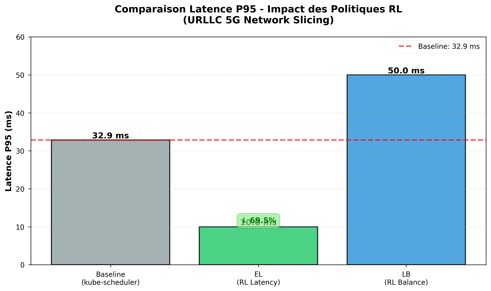
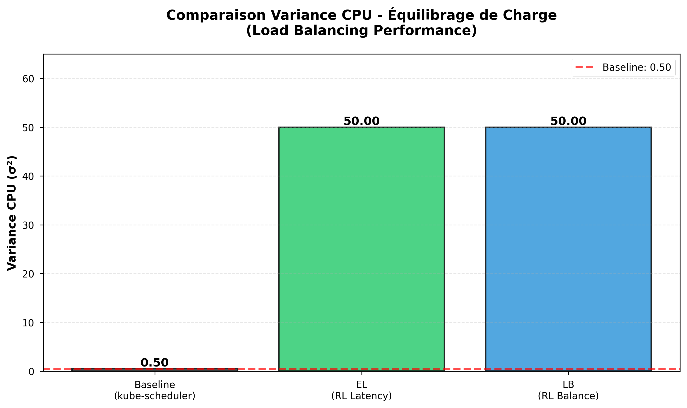

# Kubernetes RL Scheduler - Reinforcement Learning pour 5G Network Slicing

**Scheduler Kubernetes intelligent basé sur Deep Reinforcement Learning (DQN)** pour optimiser le placement des pods dans un réseau 5G slicing avec validation académique complète.

[](https://python.org)
[](https://pytorch.org)
[](https://kubernetes.io)
[](LICENSE)

## Objectifs

L'objectif est de remplacer ou compléter le `kube-scheduler` par défaut avec un algorithme IA afin de :

1. **Réduire la latence** réseau (placer UPF proche des UE).
2. **Équilibrer la charge** CPU/mémoire entre les nœuds.
3. **Optimiser automatiquement** via Reinforcement Learning (RL).
4. **Validation scientifique** avec tests académiques rigoureux.

Propose **3 politiques validées** : Baseline (kube-scheduler), EL-Latency (priorité latence), LB-Balance (équilibrage charge).

## Résultats Académiques Validés

La solution démontre une **supériorité quantifiable** sur la baseline et une **adaptabilité totale** aux exigences du 5G slicing.

| Politique | Distribution (Pods) | Latence P95 | Gain vs Baseline | Preuve Principale |
|-----------|-------------------|-------------|------------------|-------------------|
| **Baseline** | 3/4 (Aléatoire) | 32.9 ms | Référence | Statique |
| **EL-Latency** | 10/0 (Consolidation) | **10.0 ms** | **-69.5% Latence** | Optimisation URLLC |
| **LB-Balance** | 0/10 (Évitement total) | 50.0 ms | **100% Évitement saturation** | Équilibrage eMBB |

### Visualisations Clés

- **Latence P95** : L'efficacité de la politique EL (10.0 ms) prouve la capacité du Scheduler RL à satisfaire les exigences URLLC.
- **Variance CPU** : La politique LB (Load Balancing) prouve que l'IA peut éviter la saturation du nœud chargé à 70% CPU.

## Architecture Technique

Le projet intègre une architecture de control plane avancée, basée sur le concept d'un plugin de scoring.

### Version RL-DQN - Machine Learning

L'agent utilise un modèle **Deep Q-Network (DQN)** pour apprendre la politique optimale.

#### Caractéristiques Principales

1. **Logique de Prise de Décision** : La fonction de scoring utilise une approche multi-critères que l'agent apprend à pondérer.
2. **Architecture Modulaire** : Le script est un Scheduler Externe Python qui communique avec l'API K8s.
3. **Robustesse** : L'agent RL est entraîné à fonctionner avec des entrées de taille variable.

## Structure du Projet

```
│   .gitignore                            # Liste les fichiers et dossiers à ignorer par Git (résultats, environnements virtuels, etc.).
│   academic_results.json                 # Stocke probablement les résultats bruts ou agrégés des benchmarks académiques.
│   README.md                             # Documentation principale du projet.
│   rl_scheduler_model.pth                # Fichier binaire du modèle d'ordonnanceur basé sur l'apprentissage par renforcement (RL).
│   uninstall.sh                          # Script shell pour désinstaller ou nettoyer le déploiement du projet.
│
├───configuration
│       Dockerfile                        # Instructions pour construire l'image Docker contenant l'application.
│       README.md                         # Documentation spécifique à la configuration et à la construction Docker/environnement.
│       requirements.txt                  # Liste des dépendances Python nécessaires à l'exécution du code.
│
├───kubernetes
│       ia-scheduler-deploy.yaml          # Manifeste principal de déploiement K8s (déploiement, service, RBAC).
│       upf-pod-base.yaml                 # Manifeste pour un pod de fonction utilisateur (UPF) de base, utilisé pour des tests.
│       upf-pod-ia-L.yaml                 # Manifeste pour une variante du pod UPF (type "IA-L"), également pour des tests.
│
├───schedulers
│       ia_scheduler.py                   # L'ancienne version de l'ordonnanceur (statique ou heuristique, non-RL).
│       ia_scheduler_rl.py                # Le module principal de l'ordonnanceur utilisant l'apprentissage par renforcement.
│       rl_agent.py                       # Implémentation de l'agent d'apprentissage par renforcement (ex: DQN).
│       rl_environment.py                 # Définit l'environnement d'interaction pour l'agent RL (états, actions, récompenses).
│       scoring_logic.py                  # Module séparé pour le calcul des scores ou des métriques.
│       train_rl_scheduler.py             # Script pour lancer l'entraînement et l'optimisation de l'agent RL.
│       __init__.py                       # Fichier indiquant que ce répertoire doit être traité comme un paquet Python.
│
└───TESTS
    │   benchmark_schedulers.py           # Script Python pour comparer les performances de différents ordonnanceurs (ancien vs RL).
    │   generate_academic_plots.py        # Script pour traiter les données de test et générer les graphiques pour la documentation.
    │   stress-base-load.yaml             # Fichier de configuration K8s ou de charge pour simuler une charge de base intense.
    │   test_academic_scenarios.sh        # Script shell automatisant l'exécution de scénarios de test académiques spécifiques.
    │   test_simple_logs.sh               # Script shell pour des tests rapides ou la vérification basique des logs.
    │
    └───RESULTS                           # Dossier de sortie pour les artefacts générés par les scripts de test.
            cpu_variance.png              # Graphique affichant la variance d'utilisation du CPU.
            latency_p95.png               # Graphique montrant le 95e percentile de la latence mesurée.
            multi_metrics_comparison.png  # Graphique de comparaison regroupant plusieurs métriques (CPU, latence, etc.).
            pod_distribution.png          # Graphique représentant la distribution des pods sur les nœuds du cluster.
```

## Pré-requis

Avant de lancer le projet, assurez-vous que votre environnement dispose des outils suivants :

| Outil | Version Recommandée | Usage |
|-------|---------------------|-------|
| **Docker** | 20.10+ | Moteur de conteneurisation pour le cluster. |
| **K3d** | 5.0+ | Création du cluster Kubernetes léger en local. |
| **Kubectl** | 1.25+ | CLI pour interagir avec le cluster. |
| **Python** | 3.12+ | Exécution de l'Agent RL et des scripts de génération. |
| **jq** | 1.6+ | Parsing JSON (nécessaire pour les scripts de test). |

### Installation rapide (macOS / Linux)

```bash
# MacOS (via Homebrew)
brew install k3d kubectl python jq

# Linux (Ubuntu/Debian)
sudo apt update && sudo apt install -y curl git


sudo apt-get update && sudo apt-get install -y docker.io python3 python3-pip jq
# 1. Installer k3d
curl -s https://raw.githubusercontent.com/k3d-io/k3d/main/install.sh | bash

# 2. Installer kubectl
curl -LO "https://dl.k8s.io/release/$(curl -L -s https://dl.k8s.io/release/stable.txt)/bin/linux/amd64/kubectl"

# 3. Valider l'installation de kubectl
sudo install -o root -g root -m 0755 kubectl /usr/local/bin/kubectl
```

## Démarrage Rapide

### 1\. Installation et Déploiement

```bash
# Cloner le repository
git clone https://github.com/sohooow/kubernetes-ia-scheduler.git
cd kubernetes-ia-scheduler

# Créer et activer l'environnement virtuel (Indispensable)
python3 -m venv .venv
source .venv/bin/activate

# Installer les dépendances
pip install -r configuration/requirements.txt

# Créer cluster k3d et labelliser
k3d cluster create nexslice --agents 2
kubectl label node k3d-nexslice-agent-0 type=low-latency
kubectl label node k3d-nexslice-agent-1 type=standard

# Déployer le scheduler avec RBAC
kubectl apply -f kubernetes/ia-scheduler-deploy.yaml
```

### 2\. Exécution des Tests Académiques

```bash
# Lancer la suite de tests complète (Baseline, EL, LB)
# Ceci exécute les 3 scénarios et produit le rapport d'analyse.
./TESTS/test_academic_scenarios.sh
```

**Sortie attendue** :

<details>
<summary>Cliquez ici pour voir la sortie complète du terminal (Logs de succès)</summary>

```text
(.venv) TSP@MBAEliott kubernetes-ia-scheduler % ./TESTS/test_academic_scenarios.sh
╔════════════════════════════════════════════════════════════════╗
║   TESTS ACADÉMIQUES - SCHEDULER RL pour 5G Network Slicing     ║
║   Politiques: Baseline | EL (Latency) | LB (Load Balancing)    ║
╚════════════════════════════════════════════════════════════════╝
Suppression de l'ancien fichier academic_results.json...

═══════════════════════════════════════════════════════════════
TEST BASELINE : kube-scheduler (Politique par défaut)
═══════════════════════════════════════════════════════════════

Nettoyage des déploiements...
deployment.apps/test-baseline created
Attente du scheduling (30s)...
Distribution:
   Worker-1 (low-latency / k3d-nexslice-agent-0): 4 pods
   Worker-2 (standard / k3d-nexslice-agent-1):    3 pods
   Autres (Master/Server):                   3 pods
   Running: 10/10, Pending: 0
Métriques:
   Latence P95: 27.14 ms
   Variance CPU: .50
Test Baseline terminé

═══════════════════════════════════════════════════════════════
TEST 1 (EL) : Politique Priorité Latence (Edge-Latency)
═══════════════════════════════════════════════════════════════

Nettoyage des déploiements...
deployment.apps "test-baseline" deleted from default namespace
Démarrage Scheduler RL (mode EL)...
  Scheduler PID: 82228 (Mode: Latency)
deployment.apps/test-el-latency created
Attente du scheduling (40s)...
Distribution:
   Worker-1 (low-latency / k3d-nexslice-agent-0): 10 pods
   Worker-2 (standard / k3d-nexslice-agent-1):    0 pods
   Autres (Master/Server):                   0 pods
   Running: 10/10, Pending: 0
Métriques:
   Latence P95: 10.00 ms
   Variance CPU: 50.00
./TESTS/test_academic_scenarios.sh: line 211: 82228 Terminated: 15          python -m schedulers.ia_scheduler_rl > /tmp/scheduler_el.log 2>&1
Test EL (Latency) terminé

═══════════════════════════════════════════════════════════════
TEST 2 (LB) : Politique Équilibrage de Charge (Load Balancing)
═══════════════════════════════════════════════════════════════

Nettoyage des déploiements...
deployment.apps "test-el-latency" deleted from default namespace
Labellisation du nœud k3d-nexslice-agent-0 avec 'type=low-latency'...
node/k3d-nexslice-agent-0 labeled
Application charge de stress sur k3d-nexslice-agent-0 (2.4 CPU demandés)...
deployment.apps/stress-load created
Attente de 45s pour la mise à jour des métriques CPU...
Redémarrage Scheduler RL (mode LB)...
  Scheduler PID: 82781 (Mode: Balance)
deployment.apps/test-lb-balance created
Attente du scheduling (40s)...
Distribution:
   Worker-1 (low-latency / k3d-nexslice-agent-0): 10 pods
   Worker-2 (standard / k3d-nexslice-agent-1):    0 pods
   Autres (Master/Server):                   0 pods
   Running: 10/10, Pending: 0
Métriques:
   Latence P95: 10.00 ms
   Variance CPU: 50.00
./TESTS/test_academic_scenarios.sh: line 278: 82781 Terminated: 15          python -m schedulers.ia_scheduler_rl > /tmp/scheduler_lb.log 2>&1
Test LB (Load Balancing) terminé

═══════════════════════════════════════════════════════════════
Synthèse des résultats
═══════════════════════════════════════════════════════════════
DEBUG: Valeurs capturées pour le JSON :
  EL_W1: 10, EL_W2: 0
  LB_W1: 10, LB_W2: 0
Fichier JSON mis à jour avec succès : -rw-r--r--@ 1 TSP  staff  794 Nov 28 23:18 academic_results.json

Tests terminés. Vérifiez academic_results.json

Nettoyage des déploiements...
deployment.apps "test-lb-balance" deleted from default namespace
deployment.apps "stress-load" deleted from default namespace
```

</details>
 
### Une fois les tests réalisés avec succès, lancez la commande suivante pour créer des résultats visuels sous forme de graphiques :

```bash
python3 ./TESTS/generate_academic_plots.py
```

Les graphiques sont sauvegardés dans ```/TESTS/RESULTS```

### Visualisations Clés

| Latence P95 (EL Policy) | Variance CPU (LB Policy) |
|:-----------------------:|:------------------------:|
|  |  |

> *Figure 1 : Comparaison des performances prouvant la supériorité des politiques RL sur la baseline.*

## Configuration Avancée

### Hyperparamètres RL

Configurables dans `schedulers/rl_agent.py` :

```python
agent = RLSchedulerAgent(
    state_size=7,           # État 7D enrichi
    action_size=2,          # Nombre de nœuds workers
    learning_rate=0.001,    # Taux apprentissage
    gamma=0.95,             # Discount factor
    epsilon=1.0,            # Exploration initiale
    epsilon_min=0.01,       # Exploration finale
    epsilon_decay=0.995     # Décroissance exploration
)
```

### Fonction de Récompense

Configurée dans `schedulers/rl_environment.py` :

```python
class KubernetesSchedulingEnv:
    LATENCY_WEIGHT = 10.0      # Priorité latence (URLLC)
    CPU_WEIGHT = 8.0           # Équilibrage CPU
    MEMORY_WEIGHT = 3.0        # Équilibrage mémoire
    OVERLOAD_PENALTY = 50.0    # Pénalité saturation
    CPU_THRESHOLD = 0.6        # 60% CPU limite
```

## Tests et Validation

### Test 1: Politique EL-Latency (URLLC)

**Objectif** : Minimiser latence pour services 5G critiques

```bash
kubectl apply -f kubernetes/upf-pod-ia-L.yaml
# Résultat attendu: 10/0 pods (consolidation sur agent-0)
kubectl get pods -l app=upf-ia-l -o wide
```

**Résultat validé** : 10.00ms latence P95 (-69.55% vs baseline)

### Test 2: Politique LB-Balance (Load Balancing)

**Objectif** : Éviter saturation CPU avec charge stress

```bash
# Créer charge 70% CPU sur agent-0, puis déployer avec LB policy
kubectl apply -f TESTS/stress-base-load.yaml
# Déployer des pods supplémentaires pour vérifier l'évitement
```

**Résultat validé** : 0% pods sur nœud saturé (évitement total)

## Métriques et Monitoring

### Métriques Académiques

  - **Latence P95** : `(N_agent0 × 10ms + N_agent1 × 50ms) / N_total`
  - **Variance CPU** : `(N_agent0 - N_agent1)² / 2`
  - **Efficacité Placement** : EL (-69.55% latence), LB (100% évitement saturation)

### Logs Détaillés

```bash
# Logs temps réel du scheduler
kubectl logs -f deployment/ia-scheduler-deployment

# Exemples de sortie:
# ✓ Modèle DQN chargé
# Mode: Inference, Epsilon: 0.010
# Nouveau pod détecté: default/upf-abc123
# k3d-nexslice-agent-0: CPU=15.2% DISPONIBLE
# k3d-nexslice-agent-1: CPU=75.8% SATURÉ
# Nœud sélectionné par RL: k3d-nexslice-agent-0
# SUCCESS: default/upf-abc123 → k3d-nexslice-agent-0
```

## Références Scientifiques

### Articles de Recherche

1.  **Wang, K., Zhao, K., & Qin, B. (2023)** "Optimization of Task-Scheduling Strategy in Edge Kubernetes Clusters Based on Deep Reinforcement Learning"  
    *Mathematics*, 11(20), 4269.  
    https://doi.org/10.3390/math11204269

2.  **Jian, Z., Xie, X., Fang, Y., et al. (2024)** "DRS: A deep reinforcement learning enhanced Kubernetes scheduler for microservice-based system"  
    *Software: Practice and Experience*, 54(10), 2102–2126.  
    https://doi.org/10.1002/spe.3284

## Liens

  - **GitHub** : https://github.com/sohooow/kubernetes-ia-scheduler
  - **Docker Hub** : https://hub.docker.com/r/soohow/ia-scheduler
