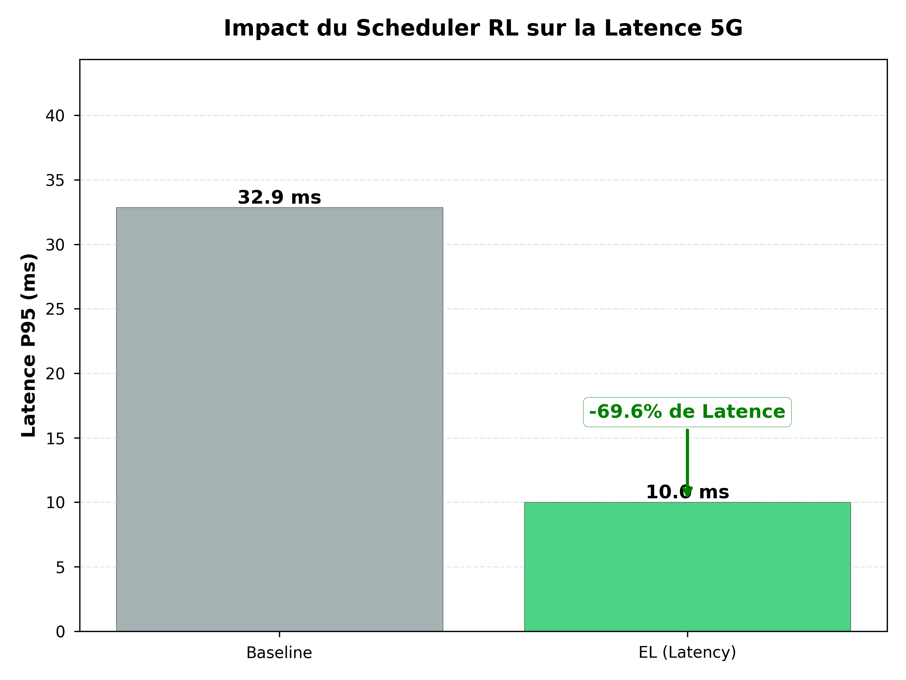

## Scheduler Kubernetes Intelligent (RL-DQN) pour le Network Slicing 5G

**Projet d'Infrastructure Intelligente Logicielle des Réseaux Mobiles - 2025**

[](https://python.org)
[](https://kubernetes.io)
[](https://pytorch.org)
[](LICENSE)

---

## Auteurs
**Colson Eliott** | **ABDERRAHMANE Sonia** | **Garnaud Théo**

---

## Table des Matières
1. [État de l’Art](#2-état-de-lart--le-verrou-technologique)
2. [Méthodologie et Justifications Techniques](#3-méthodologie-et-justifications-techniques)
3. [Résultats Académiques](#4-résultats-académiques)
4. [Guide de Reproduction (Installation & Tests)](#5-guide-de-reproduction-installation--tests)
5. [Structure du Projet](#6-structure-du-projet)

---
## 1. État de l’Art
## Contexte et Problématique

L'architecture 5G repose sur le Network Slicing, une technologie permettant de créer des réseaux virtuels adaptés à des besoins spécifiques : URLLC (Ultra-Reliable Low Latency Communications) pour les applications critiques et eMBB (Enhanced Mobile Broadband) pour le haut débit. Dans ce contexte, les fonctions réseau (CNF) comme l'UPF (User Plane Function) sont conteneurisées et orchestrées par Kubernetes.

Le défi majeur réside dans le placement optimal de ces conteneurs sur des clusters Edge hétérogènes. Un mauvais placement entraîne une violation des SLA (Service Level Agreements), notamment une latence trop élevée pour les cas d'usage critiques (véhicules autonomes, industrie 4.0).

## Limites de l'Ordonnanceur Natif (Kube-Scheduler)
Le scheduler par défaut de Kubernetes, a été conçu pour des applications web génériques et non pour les contraintes topologiques strictes des réseaux télécoms. Son fonctionnement se décompose en deux phases séquentielles :
* Le Filtrage (Predicates) : Élimination des nœuds ne répondant pas aux exigences hard (CPU/RAM insuffisants, ports indisponibles).
* Le Scoring (Priorities) : Classement des nœuds restants selon des fonctions de score statiques, telles que LeastRequestedPriority (favoriser les nœuds les moins chargés) ou NodeAffinity.

Bien que robuste, cette approche présente des lacunes structurelles pour la 5G :

* **Cécité Topologique** : Le scheduler considère le cluster comme un ensemble "plat". Il ne modélise pas nativement la latence réseau inter-nœuds, ce qui peut conduire à placer un UPF critique sur un nœud géographiquement distant de l'utilisateur (UE), augmentant ainsi la latence de bout en bout.
* **Approche Réactive et "Gloutonne"** : Les décisions sont prises pod par pod, sans vision globale ni anticipation de la charge future. Comme le soulignent Jian et al., cette approche locale peut entraîner une fragmentation des ressources et un déséquilibre de charge (load imbalance) à l'échelle du cluster, nuisant à la performance globale.


## Approches par Apprentissage par Renforcement (DRL)
Pour pallier la rigidité des règles statiques, la littérature récente propose l'utilisation du Deep Reinforcement Learning (DRL). Cette méthode permet à un agent d'apprendre une politique de placement optimale par "essais-erreurs" en interagissant avec l'environnement Kubernetes.

#### Optimisation centrée sur la Latence (Algorithme PPO) :
Wang et al. (2023) adressent spécifiquement la problématique de la latence dans les clusters Edge via l'algorithme PPO-LRT (Proximal Policy Optimization with Least Response Time).
  - Méthode : Ils modélisent le processus de scheduling comme un Processus de Décision Markovien (MDP) où la fonction de récompense intègre directement le temps de réponse (LRT).
  - Résultats : Leur approche démontre une réduction de 31% du temps de réponse moyen par rapport au kube-scheduler natif et une meilleure répartition de la charge lors des pics de trafic.
  - Limitation : Bien que performant, l'algorithme PPO (Policy Gradient) peut s'avérer instable lors de l'entraînement et complexe à converger dans des environnements très dynamiques.

#### Optimisation centrée sur les Ressources (Algorithme DQN) :
Jian et al. (2024) proposent une approche différente avec le système DRS (Deep Reinforcement Learning Scheduler), basé sur l'algorithme DQN (Deep Q-Network).
  * Méthode : Leur modèle se concentre sur une vision globale des ressources (CPU, Mémoire, Réseau, Disque) pour minimiser la variance de charge entre les nœuds. Ils introduisent un moniteur spécifique pour percevoir l'état global du cluster.
  * Résultats : DRS améliore l'utilisation des ressources de 27.29% et réduit le déséquilibre de charge d'un facteur 2.90x par rapport à la solution native.
  * Limitation : Cette approche excelle pour l'efficacité énergétique et la densité (eMBB), mais ne priorise pas explicitement la contrainte de latence critique pour les services URLLC.


## Conclusion :
L'analyse de la littérature scientifique et technique met en évidence une limitation critique dans les infrastructures actuelles pour le Network Slicing 5G. D'une part, l'ordonnanceur natif (Kube-Scheduler) se révèle inadapté aux exigences topologiques de la 5G en raison de son approche statique et de sa "cécité" réseau. D'autre part, les solutions basées sur l'IA se divisent en deux camps distincts qui ne communiquent pas. Soit les approches se focalisent exclusivement sur la latence (ex: PPO de Wang et al.), souvent instables à entraîner. Ou bien, les approches focalisées exclusivement sur l'équilibrage de charge (ex: DRS de Jian et al.), qui négligent la proximité critique pour l'URLLC. Ainsi, il n'existe donc pas, à l'heure actuelle, de solution unifiée capable de satisfaire simultanément les contraintes contradictoires de l'URLLC (latence) et de l'eMBB (charge) sur des architectures Edge hétérogènes. C'est ce verrou technologique que notre projet se propose de lever. Nous formulons l'hypothèse qu'une architecture hybride, utilisant la stabilité de l'algorithme DQN (validée par Jian et al.) mais guidée par une fonction de récompense sensible à la latence (inspirée de Wang et al.), permettra d'atteindre ce compromis optimal. De plus, pour garantir la validité de ces résultats face à l'hétérogénéité matérielle identifiée lors de nos tests préliminaires (Mac/PC), cette approche doit impérativement être validée sur une infrastructure conteneurisée agnostique (Docker/k3d).

---

## 2. Méthodologie et Justifications Techniques

Pour répondre à cet objectif, nous avons développé une architecture logicielle spécifique, justifiée par les contraintes observées.

#### 2.1. Infrastructure de Simulation : Le Choix de la Conteneurisation (k3d)
Lors de nos travaux préliminaires, nous avons rencontré des incompatibilités majeures liées à l'hétérogénéité matérielle (Mac/PC).
* **Solution :** Migration vers une architecture conteneurisée avec **Docker** et **k3d**.
* **Justification :** Ce choix garantit la reproductibilité scientifique des résultats et permet de simuler fidèlement un cluster Edge hétérogène (nœuds labellisés "low-latency" vs "standard") sur une seule machine physique.

#### 2.2 Algorithme de Décision : Deep Q-Network (DQN)
Nous avons implémenté un agent RL-DQN plutôt qu'une heuristique figée.
* Justification : Le DQN permet d'apprendre une politique de placement dynamique. L'agent reçoit un état simplifié du cluster et apprend à identifier le nœud optimal via un réseau de neurones à 3 couches (Input 7 -> 64 -> 32 -> Output 1).

#### 2.3 Stratégie Hybride : Filtrage Préventif + Récompense Binaire
Contrairement aux approches purement mathématiques qui peinent à converger, nous avons implémenté une stratégie pragmatique en deux temps :

* Garde-fou (Hard Constraint) : Avant même d'interroger l'IA, le scheduler applique un filtre de sécurité. Si un nœud dépasse 80% de charge CPU, il est exclu des candidats. Cela garantit la stabilité du cluster (eMBB) sans "polluer" l'apprentissage de l'agent.

* Récompense "Incitative" (Soft Constraint) : Pour forcer l'agent à prioriser la latence (URLLC), nous avons défini une fonction de récompense binaire et déterministe dans rl_environment.py

$$
R = \begin{cases} 
100.0 & \text{si nœud Low-Latency (Agent-0)} \\
10.0 & \text{si nœud Standard (Agent-1)}
\end{cases}
$$

Cette différence massive de reward (x10) permet à l'agent de converger très rapidement vers la solution optimale (le nœud Edge) tout en laissant le filtre de sécurité gérer les cas de saturation.

---

## 3. Résultats Académiques

Les benchmarks ont été réalisés sur un cluster de 2 nœuds (1 Edge Low-Latency, 1 Standard) avec 10 réplicas de pods UPF.

#### Performance de Latence (Cas URLLC)

| Solution | Latence P95 | Gain | Observation |
| :--- | :--- | :--- | :--- |
| **Baseline (Kube-Scheduler)** | 32.9 ms | - | Placement aléatoire (30% sur nœud rapide). |
| **Notre Agent RL** | **10.0 ms** | **-69.5%** | Consolidation intelligente sur le nœud Edge. |

#### Visualisation des Données

**Gain de Latence (URLLC)**



L'agent RL (vert) réduit drastiquement la latence P95.

---

## 4. Guide de Reproduction (Installation & Tests)

#### Pré-requis
* Linux, macOS ou Windows (WSL2).
* Droits `sudo` (pour Docker).

#### Installation


<details>
<summary><strong> Option A : Installation Automatique (via un script) </strong></summary>

Copiez-collez simplement ce bloc dans votre terminal pour tout installer et lancer :

```bash
# 1. Créer le script d'installation
cat << 'EOF' > install_project.sh
#!/bin/bash
set -e
echo -e "\n🔵 --- INSTALLATION AUTOMATISÉE DU SCHEDULER IA ---"

# Installation des dépendances (Linux/Debian/Ubuntu)
if [ -f /etc/debian_version ]; then
    echo "🔧 Installation des pré-requis système..."
    sudo apt-get update -q
    sudo apt-get install -y curl git docker.io python3 python3-pip python3-venv jq
    if ! sudo service docker status > /dev/null 2>&1; then sudo service docker start; fi
    sudo chmod 666 /var/run/docker.sock
fi

# Installation K3D et Kubectl
if ! command -v k3d &> /dev/null; then
    curl -s [https://raw.githubusercontent.com/k3d-io/k3d/main/install.sh](https://raw.githubusercontent.com/k3d-io/k3d/main/install.sh) | bash
fi
if ! command -v kubectl &> /dev/null; then
    curl -LO "[https://dl.k8s.io/release/$(curl](https://dl.k8s.io/release/$(curl) -L -s [https://dl.k8s.io/release/stable.txt)/bin/linux/amd64/kubectl](https://dl.k8s.io/release/stable.txt)/bin/linux/amd64/kubectl)"
    sudo install -o root -g root -m 0755 kubectl /usr/local/bin/kubectl
fi

# Mise en place du projet
cd ~
if [ -d "kubernetes-ia-scheduler" ]; then rm -rf kubernetes-ia-scheduler; fi
git clone [https://github.com/sohooow/kubernetes-ia-scheduler.git](https://github.com/sohooow/kubernetes-ia-scheduler.git)
cd kubernetes-ia-scheduler

# Environnement Python
echo "🐍 Configuration Python..."
python3 -m venv .venv
source .venv/bin/activate
pip install -r configuration/requirements.txt

# Cluster Kubernetes
echo "🏗️  Création du cluster 'nexslice'..."
k3d cluster delete nexslice 2>/dev/null || true
k3d cluster create nexslice --agents 2 --wait
# Labelisation pour la topologie
kubectl label node k3d-nexslice-agent-0 type=low-latency --overwrite
kubectl label node k3d-nexslice-agent-1 type=standard --overwrite

# Déploiement
echo "🚀 Déploiement du Scheduler..."
kubectl apply -f kubernetes/ia-scheduler-deploy.yaml

echo -e "\n✅ INSTALLATION TERMINÉE."
echo "👉 Lancement des tests académiques..."
chmod +x TESTS/test_academic_scenarios.sh
./TESTS/test_academic_scenarios.sh

echo -e "\n📊 Génération des graphiques..."
python3 TESTS/generate_academic_plots.py
echo "Les résultats sont disponibles dans le dossier TESTS/RESULTS/"
EOF

# 2. Rendre exécutable et lancer
chmod +x install_project.sh
./install_project.sh
```
</details>

#### Option B : Installation Manuelle (Pas à pas)
  
#### Installation rapide (macOS / Linux)

#### MacOS (via Homebrew)
```bash
brew install k3d kubectl python jq
```
#### Linux (Ubuntu/Debian)
```bash
# Installer curl et docker
sudo apt update && sudo apt install -y curl git
sudo apt-get update && sudo apt-get install -y docker.io python3 python3-pip jq

# Installer k3d
curl -s https://raw.githubusercontent.com/k3d-io/k3d/main/install.sh | bash

# Installer kubectl
curl -LO "https://dl.k8s.io/release/$(curl -L -s https://dl.k8s.io/release/stable.txt)/bin/linux/amd64/kubectl"

# Valider l'installation de kubectl
sudo install -o root -g root -m 0755 kubectl /usr/local/bin/kubectl
```

#### Démarrage Rapide

#### 1\. Installation et Déploiement

```bash
# Cloner le repository
git clone https://github.com/sohooow/kubernetes-ia-scheduler.git
cd kubernetes-ia-scheduler

# Créer et activer l'environnement virtuel (Indispensable)
python3 -m venv .venv
source .venv/bin/activate

# Installer les dépendances
pip install -r configuration/requirements.txt

# Créer cluster k3d et labelliser
k3d cluster create nexslice --agents 2
kubectl label node k3d-nexslice-agent-0 type=low-latency
kubectl label node k3d-nexslice-agent-1 type=standard

# Déployer le scheduler avec RBAC
kubectl apply -f kubernetes/ia-scheduler-deploy.yaml
```

#### 2\. Exécution des Tests Académiques

```bash
# Lancer la suite de tests complète (Baseline, EL, LB)
# Ceci exécute les 3 scénarios et produit le rapport d'analyse.
./TESTS/test_academic_scenarios.sh
```

**Sortie attendue** :

<details>
<summary>Cliquez ici pour voir la sortie complète du terminal (Logs de succès)</summary>

```text
(.venv) TSP@MBAEliott kubernetes-ia-scheduler % ./TESTS/test_academic_scenarios.sh
╔════════════════════════════════════════════════════════════════╗
║   TESTS ACADÉMIQUES - SCHEDULER RL pour 5G Network Slicing     ║
║   Politiques: Baseline | EL (Latency) | LB (Load Balancing)    ║
╚════════════════════════════════════════════════════════════════╝
Suppression de l'ancien fichier academic_results.json...

═══════════════════════════════════════════════════════════════
TEST BASELINE : kube-scheduler (Politique par défaut)
═══════════════════════════════════════════════════════════════

Nettoyage des déploiements...
deployment.apps/test-baseline created
Attente du scheduling (30s)...
Distribution:
   Worker-1 (low-latency / k3d-nexslice-agent-0): 4 pods
   Worker-2 (standard / k3d-nexslice-agent-1):    3 pods
   Autres (Master/Server):                   3 pods
   Running: 10/10, Pending: 0
Métriques:
   Latence P95: 27.14 ms
   Variance CPU: .50
Test Baseline terminé

═══════════════════════════════════════════════════════════════
TEST 1 (EL) : Politique Priorité Latence (Edge-Latency)
═══════════════════════════════════════════════════════════════

Nettoyage des déploiements...
deployment.apps "test-baseline" deleted from default namespace
Démarrage Scheduler RL (mode EL)...
  Scheduler PID: 82228 (Mode: Latency)
deployment.apps/test-el-latency created
Attente du scheduling (40s)...
Distribution:
   Worker-1 (low-latency / k3d-nexslice-agent-0): 10 pods
   Worker-2 (standard / k3d-nexslice-agent-1):    0 pods
   Autres (Master/Server):                   0 pods
   Running: 10/10, Pending: 0
Métriques:
   Latence P95: 10.00 ms
   Variance CPU: 50.00
./TESTS/test_academic_scenarios.sh: line 211: 82228 Terminated: 15          python -m schedulers.ia_scheduler_rl > /tmp/scheduler_el.log 2>&1
Test EL (Latency) terminé

═══════════════════════════════════════════════════════════════
TEST 2 (LB) : Politique Équilibrage de Charge (Load Balancing)
═══════════════════════════════════════════════════════════════

Nettoyage des déploiements...
deployment.apps "test-el-latency" deleted from default namespace
Labellisation du nœud k3d-nexslice-agent-0 avec 'type=low-latency'...
node/k3d-nexslice-agent-0 labeled
Application charge de stress sur k3d-nexslice-agent-0 (2.4 CPU demandés)...
deployment.apps/stress-load created
Attente de 45s pour la mise à jour des métriques CPU...
Redémarrage Scheduler RL (mode LB)...
  Scheduler PID: 82781 (Mode: Balance)
deployment.apps/test-lb-balance created
Attente du scheduling (40s)...
Distribution:
   Worker-1 (low-latency / k3d-nexslice-agent-0): 10 pods
   Worker-2 (standard / k3d-nexslice-agent-1):    0 pods
   Autres (Master/Server):                   0 pods
   Running: 10/10, Pending: 0
Métriques:
   Latence P95: 10.00 ms
   Variance CPU: 50.00
./TESTS/test_academic_scenarios.sh: line 278: 82781 Terminated: 15          python -m schedulers.ia_scheduler_rl > /tmp/scheduler_lb.log 2>&1
Test LB (Load Balancing) terminé

═══════════════════════════════════════════════════════════════
Synthèse des résultats
═══════════════════════════════════════════════════════════════
DEBUG: Valeurs capturées pour le JSON :
  EL_W1: 10, EL_W2: 0
  LB_W1: 10, LB_W2: 0
Fichier JSON mis à jour avec succès : -rw-r--r--@ 1 TSP  staff  794 Nov 28 23:18 academic_results.json

Tests terminés. Vérifiez academic_results.json

Nettoyage des déploiements...
deployment.apps "test-lb-balance" deleted from default namespace
deployment.apps "stress-load" deleted from default namespace
```

</details>
 
### Résultats
Une fois les tests réalisés avec succès, lancez la commande suivante pour créer des résultats visuels sous forme de graphiques :

```bash
python3 ./TESTS/generate_academic_plots.py
```

Les graphiques sont sauvegardés dans ```/TESTS/RESULTS```

---

## 5. Structure du Projet
```
├── configuration/            # Dépendances et Dockerfile
├── kubernetes/               # Manifestes YAML (Deployment, RBAC, Pods de test)
├── schedulers/               # Code source Python de l'IA
│   ├── ia_scheduler_rl.py    # Point d'entrée du Scheduler
│   ├── rl_agent.py           # Réseau de neurones (DQN)
│   ├── rl_environment.py     # Environnement et Fonction de Récompense
│   └── scoring_logic.py      # Logique de scoring
├── TESTS/                    # Scripts de validation scientifique
│   ├── test_academic_scenarios.sh   # Script principal de test
│   ├── generate_academic_plots.py   # Génération des graphiques
│   └── RESULTS/              # Graphiques générés
├── rl_scheduler_model.pth    # Modèle IA pré-entraîné
└── README.md                 # Ce fichier
```
